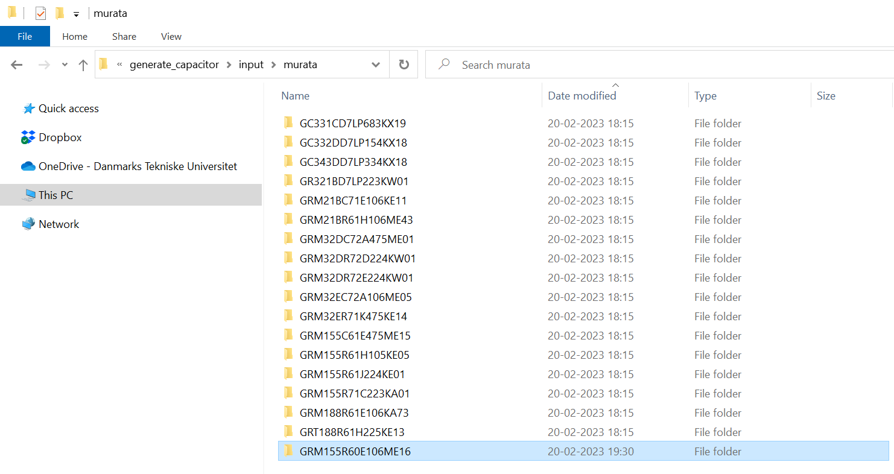
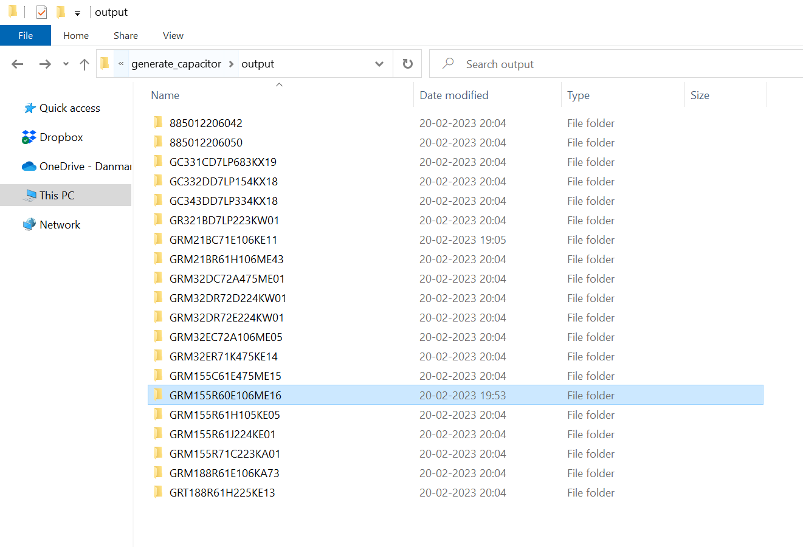

# User guide for generate_capacitor python script.

## Introduction

This user guide is for the generate_capacitor.py script. The script is responsible for generating various verilog-A models for discrete capacitors based on measurement data provided by the manufacturers website. The script requires the user to download the measurement data, update a component database excel file and then run the script. This user guide is written to help the PhD students at Leibniz University of Hannover to get started with Python, download the generate_capacitor.py script and run the script to extract a new capacitor.

## Getting started

To get started using the python script to generate verilog-A models for your discrete capacitors you need to install Python and the required Python-packages used in the script. These packages handle things like: reading/writing to excel files, reading csv data, plotting the results etc. We also need an editor from which we can open, read, edit and run the script.

### Download generate_capacitor python script:

I've created a github repository for the generate_capacitor python script:

[GitHub - muheicdesign/generate_capacitor](https://github.com/muheicdesign/generate_capacitor) 

Go to the github:

1. Press <> Code

2. Choose **Local**

3. **Download ZIP**

or if you use git (you should) then you can clone the repository how your normally would - then you can also easily get any updates to the script.

Save and extract the zip file anywhere you have your other scripts or files.

### Install VSCode (or other code editor of your preference)

We need an editor for the scripts where we can; read, edit, compile and run our scripts from. There are many good IDEs out there. I prefer VSCode.

If you don't have a preference download VSCode here: [Download Visual Studio Code - Mac, Linux, Windows](https://code.visualstudio.com/download) 

Install VSCode with default setups and open it and go through its "getting started" tutorial. It will ask you to select color schemes etc. When you've set everything as you want it - close the editor again. We'll open it later through **Anaconda**

### Installing Anaconda

While it is perfectly possible to install Python yourself and installing all the required packages one by one it is much easier to use a dedicated software for it: **Anaconda**

Anaconda is a "distribution software" that creates a virtual environment on your computer with a version of Python (default: newest) and where you can easily install new packages and open an **code editor** to edit and run your scripts.

Download anaconda here: [Anaconda | Anaconda Distribution](https://www.anaconda.com/products/distribution) 

Install Anaconda on your PC with default settings.

## Open Anaconda and create new conda environment

Open **Anaconda** on your computer. If it needs to update - then update immediately.

After opening it the "home" tab should look something like this:

Ensure that "VS Code" is there on the home tab. If it is not - then make sure that you've installed it correctly on your computer.

Now we need to create a new "Environment". The default environment is called **"base (root)"**. This has the newest version of Python installed and the most common packages. In general we don't want to mess around too much with base (root). Instead we create a new environment:

1. Go to **Environments**

2. Click **Create** 

3. Name your environment

4. Ensure that Python is checked (We don't need R).
   
   1. Just leave the Python version to whatever default it chooses. There are newer versions but they might not be fully compatible with all our packages.

After pressing **Create** the environment will be created. This might take a few minutes:

Make sure that your new environment is chosen indicated by the green play arrow. This is your current environment.

### Installing dependencies for running *generate_capacitor.py*

Note that **Installed** is selected in the drop down menu. This filters all the Python packages that has already been installed in the environment. From scratch our environment is pretty empty. Let's add the required packages to run the generate_capacitor script:

In the drop down menu **installed** choose **Not Installed** instead.

Then in the search bar to the right search and check off these packages:

* numpy

* matplotlib

* jinja2

* openpyxl

Note that the packages how now just been "selected" for installing. To install them press **Apply**

The installer will pop up with a window that shows all the co-dependent packages that these packages need. Press **Apply** again:

The installation of all the packages might take a minute or two.

When the installation has finished - everything is installed and we're ready to go!

### Choosing Python code editor

Navigate to the **Home** tab in the **Anaconda Navigator**

Ensure again that your new anaconda environment is selected at the top!

Press the **VS Code** or your preferred editor (you might have to scroll down to find it!)

### Run default generate_capacitor script

When you've opened VS Code go to File -> Open Folder --> select the "generate_capacitor" folder that you downloaded from GitHub

Press "**Select Folder**"

Your **Explorer** window in VS Code, showing you the file hiearchy, should look something like this:

Click on "**generate_capacitor.py**" this is the main script responsible for generating the Verilog-A files. Scroll to the bottom of the script until you see: 

`if __name__ == "__main__":`

You should be able to run the script by pressing:

Run -> Run Without Debugging

or you can simply press **ctrl + F5** 

Two figures should pop up and in the Terminal window some output prints should appear:

The script has now generated verilog-A models for the capacitor **GRM21BC71E106KE11**  from **murata** and evaluated the ESR at 500kHz (as indicated by Figure 2).

To stop the script click the red square on top or press **shift+F5**.

You can also just close the two Figures and the script will finish automatically. 

Congrats! That is it - you are ready to add more capacitors to the component_database excel file and contribute to a big library of discrete capacitors for all!

## Example #1 - find new capacitor and extract Verilog-A model:

To add a new capacitor to the component_database and extract it there are 3 steps:

1. Find desired capacitor and insert entry manually in component_database excel file

2. Download measurement csv data from manufacturer website and saved at correct file location.

3. Run generate_capacitor.py with anaconda environment and with the entry in the user inputs in the script.

### Find desired capacitor and add entry to component_database

In this example we will be adding a murata capacitor: # **GRM155R60E106ME16** 

The datasheet link on muratas website is: https://www.murata.com/en-eu/products/productdetail?partno=GRM155R60E106ME16%23 

Here we can see that the relevant data for the database is:

**Capacitance:** 10uF

**Rated voltage:** 2.5Vdc

**Size:** 0402

Go to the component_database excel file and open it: **component_database/component_database.xlsx** 

It already has a bunch of entries. Add the new capacitor name to the bottom of the list:

Do **not** add anything to the ESR and ESL column. These values are extracted from the script and automatically inserted whenever you run generate_capacitor.py.

Save and close the component_database.xlsx file

### Download measurement csv data from manufacturer website and saved at correct file location:

Now we need to download the csv data from the Murata webpage and save it in the correct folder.

First let's create the folder for our capacitor. Navigate to input -> murata and create a folder with the name of the capacitor: 

This is where we will add our csv data.

To download the .csv data go to the murata capacitor datasheet again: https://www.murata.com/en-eu/products/productdetail?partno=GRM155R60E106ME16%23 

Scroll down until your see the "Simsurfing" characteristic data:

**Note**: Not all capacitors have characteristic data in the website and sometimes the DC bias characteristics and not measured. If that is the case - too bad. We cannot generate a proper model for it.

Click the red **(SimSurfing)Go to detailed chart** button. This opens a new tab. Press "Agree" on the License Agreement.

From here we can download the csv data for the measurement results. We need to download three individual files:

1. DC bias characteristics

2. AC impedance frequency characteristic

3. ESR frequency characteristic

First download the DC bias characteristic by pressing the small "**csv**" icon underneath the graph:

save the file in the folder you created earlier and name it: GRM155R60E106ME16_dc_bias

Now for the AC impedance and the ESR frequency characteristics these are both located on the same figure:

We want to download the two graphs in two seperate files. The webpage is a bit annoying though, since pressing the close button [X] removes the graph completely. 

I usually open the website in two tabs and close the ESR in one of them and the AC impedance in the other:

Save the csv data for both graphs to the folder you created earlier. Ensure that they have the correct filenames:

**For AC impedance characteristics:** GRM155R60E106ME16_ac

**For ESR frequency characteristics:** GRM155R60E106ME16_esr

This should ALWAYS be ensured when saving a new file. Since otherwise the generate_capacitor.py script cannot find the correct files.

Now your folder should look like this:

and we're ready to proceed!

### Run generate_capacitor.py with anaconda environment and with the entry in the user inputs in the script

Now we are ready to generate the verilog-a files.

**Ensure that you have closed the component_basebase excel file first!** 

Open anaconda, choose your python environment and open VSCode (as explained in the user guide above)

At the bottom of the generate_capacitor.py script there is room for user inputs:

change the capacitor variable to our new desired capacitor (as seen above) and run the script (run -> Run Without Debugging) or by pressing **ctrl+F5**:

The script should finish, write the extracted values to the component_database excel file and show figures with the polynomial fit for the capacitor degradation value and two points where ESL and ESR are calculated.

Boom! That's it! You've generated you're first verilog-A model for your capacitor.

To view the verilog-A model navigate to: output -> GRM155R60E106ME16

here are all the veriloga models. Then you just need to copy these to cadence, create a new view with a symbol and copy the veriloga file into the view.

## Example #2 - extract Verilog-A models for all entries in database:

To quickly generate **ALL** the capacitors which are already inserted in the component_database excel file (and which have the download measurement .csv data), I've created a function in the generate_capacitor.py script that is called make_all().

Scroll down to the bottom of generate_capacitor.py and comment out the "generate_capacitor(capacitor,vendor, f_esr)" line from Example 1.

Also uncomment the "make_all(f_esr)" line under Example 2:

Rerun the script by: Run -> Run Without Debugging or by pressing **ctrl+F5**. 

The make_all function simply iterates through the component_database excel file and creates a verilog-a model for each entry that also has the csv data. The script takes a minute or so to run.

After running the script go to the output folder and check all the new models:

and that's it!

## Known limitations

### Wurth not having csv data to download from website.

 Wurth does show interactable figures of their measurements but does not have the option to download the data as csv data.

The best workaround, that I've found for this is to:

1. Download the PNG pictures for dc_bias, ac characteristics and esr characteristics

2. use: [WebPlotDigitizer - Extract data from plots, images, and maps](https://automeris.io/WebPlotDigitizer/) to extract the data based on the figures and save it as a csv file.

The process is a bit slower, but it is possible to get the data! Maybe if someone pokes Wurth they could just share the csv data on their website.
